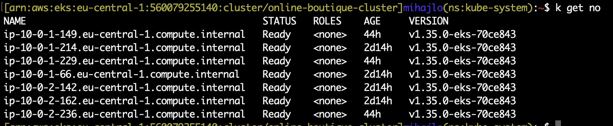
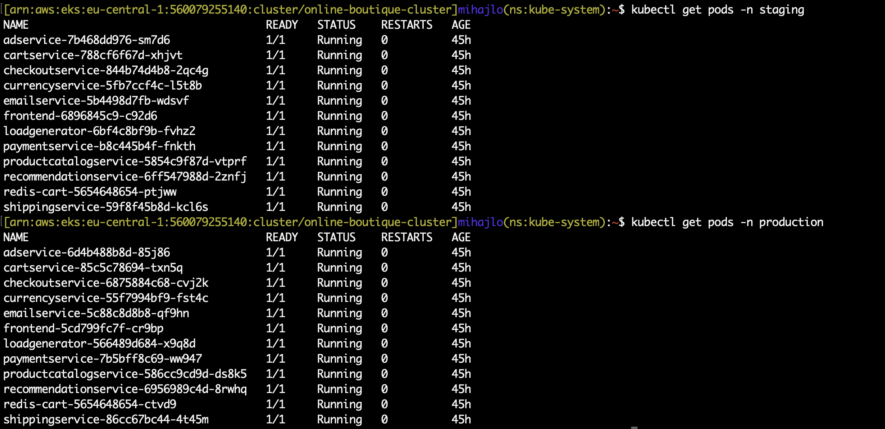
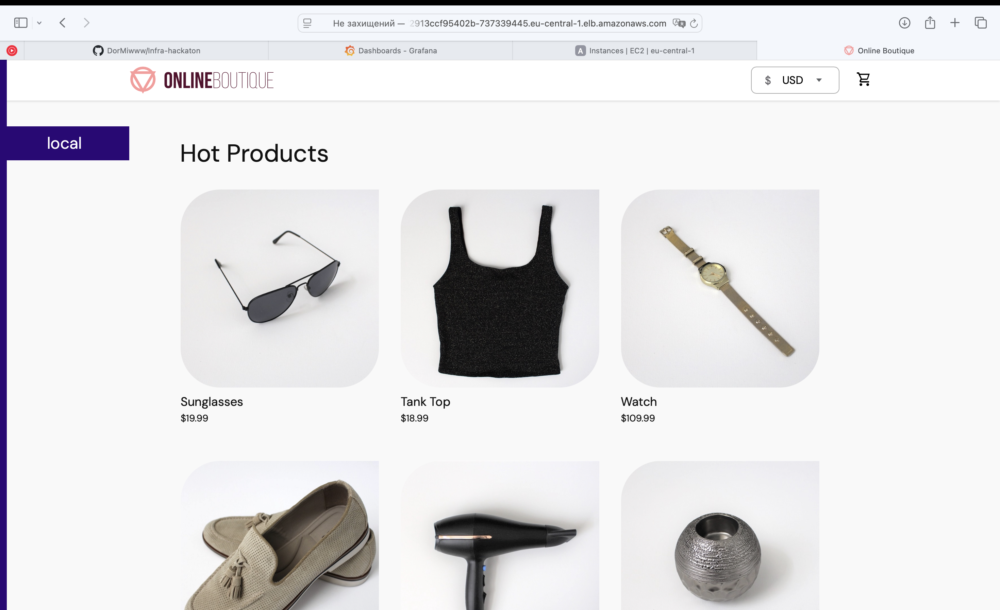
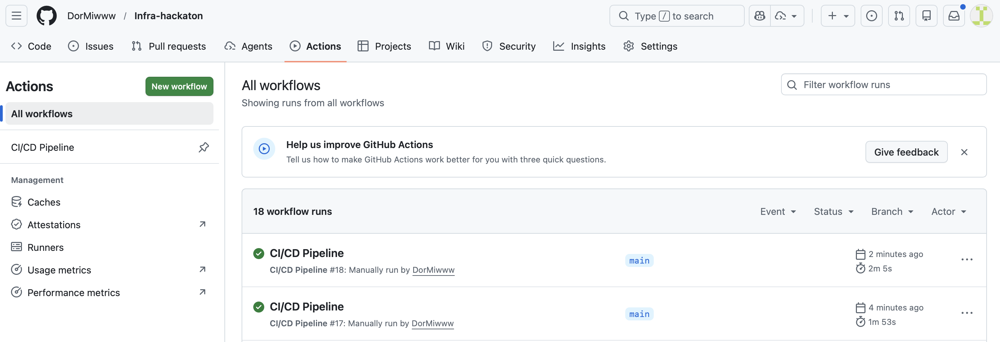
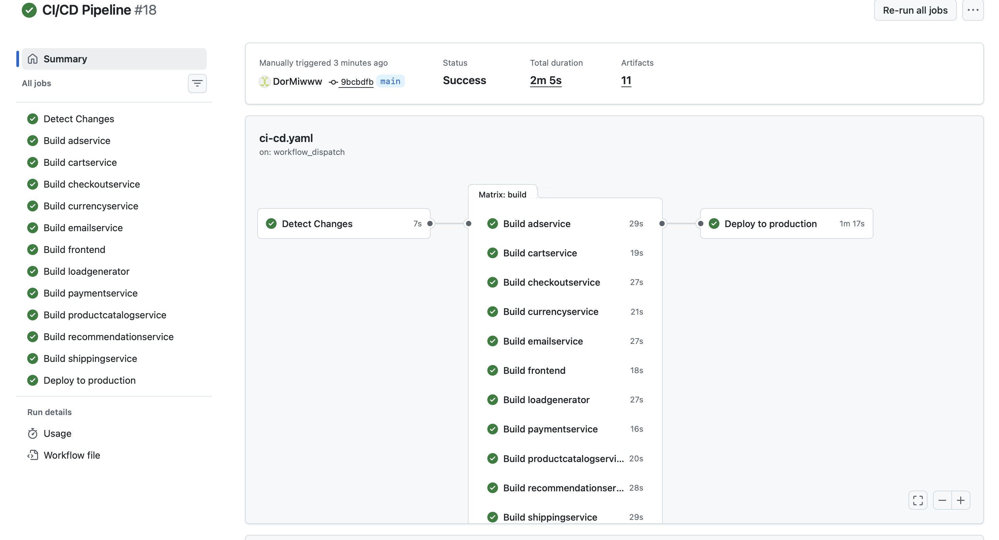
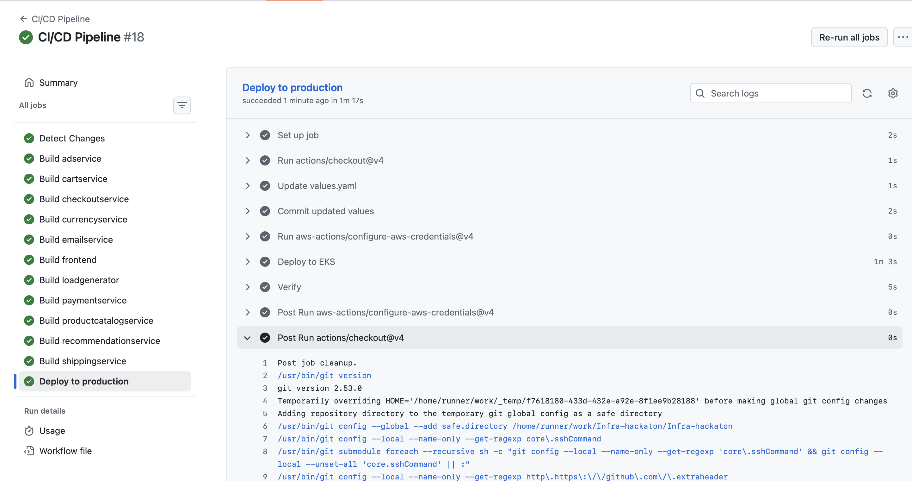
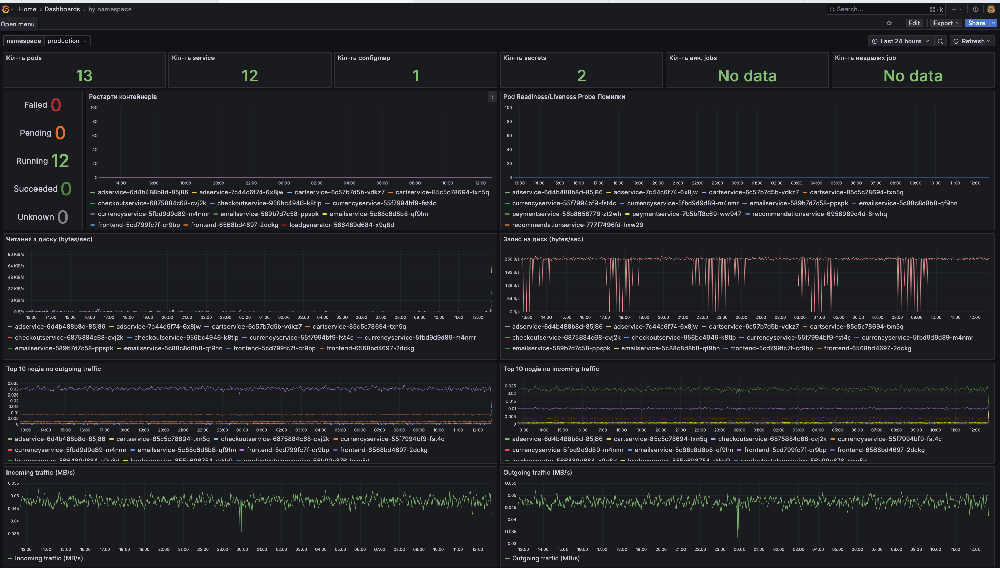
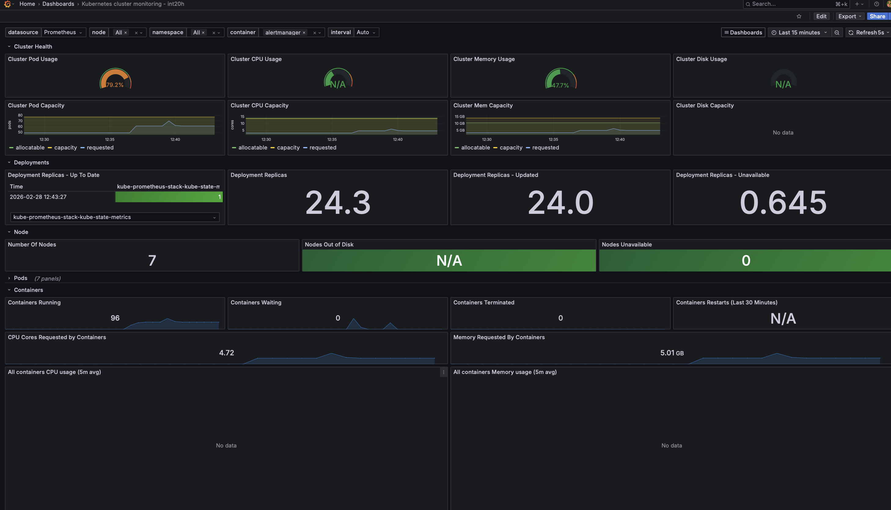
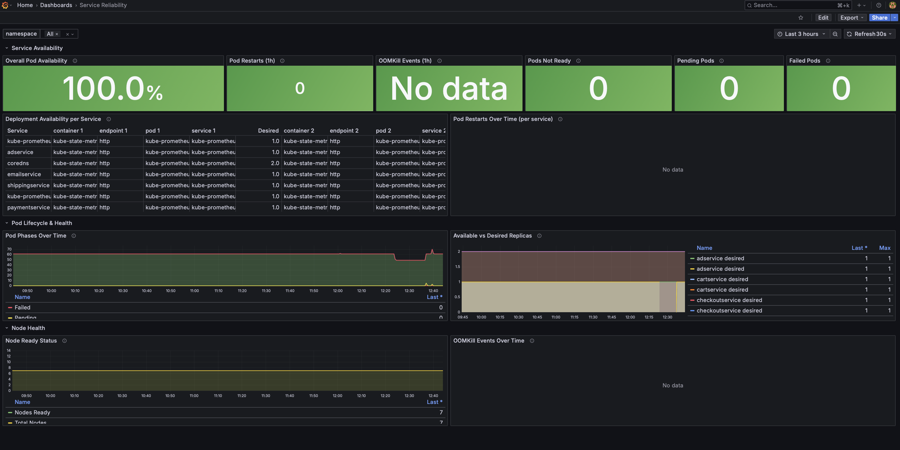
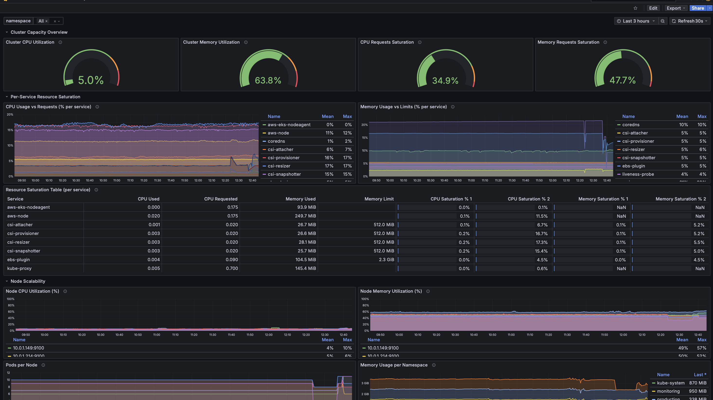

# Online Boutique — Cloud Infrastructure & CI/CD

Production-grade deployment of the [Online Boutique](https://github.com/GoogleCloudPlatform/microservices-demo) microservices application on **AWS EKS**, fully automated with **Terraform**, **Helm**, and **GitHub Actions**.

---

## Architecture Overview

The system consists of **11 microservices** written in Go, Java, C#, Node.js, and Python, deployed to a managed Kubernetes cluster on AWS. Infrastructure is provisioned as code, CI/CD handles automatic builds and deployments, and Grafana dashboards provide full observability.

```
┌──────────────────────────────────────────────────────────────┐
│                        AWS Cloud                             │
│  ┌────────────────────────────────────────────────────────┐  │
│  │                    VPC (10.0.0.0/16)                    │  │
│  │  ┌──────────────┐              ┌──────────────┐        │  │
│  │  │  Public       │              │  Private      │        │  │
│  │  │  Subnets      │──── NAT ────│  Subnets      │        │  │
│  │  └──────────────┘              └──────┬───────┘        │  │
│  │                                       │                │  │
│  │                              ┌────────▼────────┐       │  │
│  │                              │   EKS Cluster    │       │  │
│  │                              │                  │       │  │
│  │                              │  ┌────────────┐  │       │  │
│  │                              │  │ Microsvcs  │  │       │  │
│  │                              │  │ (Helm)     │  │       │  │
│  │                              │  └────────────┘  │       │  │
│  │                              │  ┌────────────┐  │       │  │
│  │                              │  │ Monitoring │  │       │  │
│  │                              │  │ Prometheus │  │       │  │
│  │                              │  │ Grafana    │  │       │  │
│  │                              │  └────────────┘  │       │  │
│  │                              └─────────────────┘       │  │
│  └────────────────────────────────────────────────────────┘  │
└──────────────────────────────────────────────────────────────┘
```

---

## Repository Structure

```
.
├── .github/workflows/
│   └── ci-cd.yaml              # GitHub Actions CI/CD pipeline
├── code/                       # Application source code
│   ├── adservice/              # Ad provider (Java)
│   ├── cartservice/            # Shopping cart (C#)
│   ├── checkoutservice/        # Order checkout (Go)
│   ├── currencyservice/        # Currency conversion (Node.js)
│   ├── emailservice/           # Order confirmation emails (Python)
│   ├── frontend/               # Web UI (Go)
│   ├── loadgenerator/          # Synthetic traffic (Python/Locust)
│   ├── paymentservice/         # Payment processing (Node.js)
│   ├── productcatalogservice/  # Product catalog (Go)
│   ├── recommendationservice/  # Product recommendations (Python)
│   └── shippingservice/        # Shipping quotes & tracking (Go)
├── helm-chart/                 # Helm chart for application deployment
│   ├── Chart.yaml
│   ├── values.yaml             # Image tags, resource limits, config
│   └── templates/              # K8s manifests per service
├── kubernetes-manifests/       # Raw Kubernetes manifests (reference)
├── terraform/                  # Infrastructure as Code
│   ├── providers.tf            # AWS, Kubernetes, Helm providers + S3 backend
│   ├── vpc.tf                  # VPC, subnets, NAT gateway
│   ├── eks.tf                  # EKS cluster, node groups, EBS CSI driver
│   ├── monitoring.tf           # Prometheus + Grafana (kube-prometheus-stack)
│   ├── namespaces.tf           # staging & production namespaces
│   ├── variables.tf            # All configurable parameters
│   └── outputs.tf              # Cluster endpoint, config outputs
├── grafana-dashboards/         # Custom Grafana dashboard JSON files
│   ├── dashboard_pods.json     # Pod-level metrics
│   ├── kubernetes-monitor.json # Cluster-wide monitoring
│   ├── reliability.json        # Service reliability & error rates
│   └── scalability.json        # Scalability & resource usage
└── docs/screenshots/           # Evidence screenshots (see below)
```

---

## Tech Stack

| Layer              | Technology                                      |
|--------------------|--------------------------------------------------|
| **Cloud**          | AWS (VPC, EKS, EBS, NAT Gateway, S3)            |
| **Orchestration**  | Kubernetes (EKS v1.35)                           |
| **IaC**            | Terraform with S3 remote state                   |
| **Packaging**      | Helm v3                                          |
| **CI/CD**          | GitHub Actions                                   |
| **Registry**       | GitHub Container Registry (GHCR)                 |
| **Monitoring**     | Prometheus + Grafana (kube-prometheus-stack)      |
| **Alerting**       | AlertManager                                     |

---

## CI/CD Pipeline

The pipeline is defined in `.github/workflows/ci-cd.yaml` and runs on every push to `main` that modifies files under `code/`.

**Pipeline stages:**

1. **Detect Changes** — identifies which microservices were modified (builds only what changed)
2. **Build & Push** — builds Docker images in parallel using matrix strategy, pushes to GHCR with commit SHA and `latest` tags
3. **Deploy** — updates `values.yaml` with new image tags, commits the change, then runs `helm upgrade --install` against EKS
4. **Verify** — confirms pods and services are running correctly

The pipeline also supports **manual dispatch** with service and environment selection (staging / production).

---

## Infrastructure (Terraform)

All cloud resources are managed via Terraform with remote state stored in S3.

**What gets provisioned:**

- **VPC** — `10.0.0.0/16` CIDR, 2 public + 2 private subnets across 2 AZs, single NAT gateway
- **EKS Cluster** — managed node group (5–8 `t3.small` instances), EBS CSI driver with IRSA, `gp3` default StorageClass
- **Monitoring** — `kube-prometheus-stack` Helm release with Prometheus (10Gi persistent storage, 7d retention), Grafana (LoadBalancer), AlertManager, Node Exporter, kube-state-metrics
- **Namespaces** — `staging` and `production`, pre-created for Helm deployments
- **Dashboards** — custom Grafana dashboards auto-provisioned from JSON via sidecar ConfigMap

---

## Grafana Dashboards

Four custom dashboards are provisioned automatically into the `int20h` folder in Grafana:

| Dashboard              | Purpose                                           |
|------------------------|---------------------------------------------------|
| **Pod Metrics**        | CPU, memory, restarts per pod                     |
| **Kubernetes Monitor** | Cluster-wide node and workload health             |
| **Reliability**        | Error rates, availability, SLI/SLO tracking       |
| **Scalability**        | Resource utilization trends and scaling indicators |

---

## Screenshots

### Deployed System in the Cloud

<!-- Add screenshots of the running EKS cluster, pods, and services -->







### CI/CD Pipeline

<!-- Add screenshots of successful GitHub Actions runs -->







### Grafana Dashboards

<!-- Add screenshots of each Grafana dashboard -->









---

## Getting Started

### Prerequisites

- AWS CLI configured with appropriate credentials
- Terraform >= 1.0
- kubectl
- Helm 3
- Docker (for local builds)

### Deploy Infrastructure

```bash
cd terraform
terraform init
terraform plan
terraform apply
```

### Configure kubectl

```bash
aws eks update-kubeconfig --name online-boutique-cluster --region eu-central-1
```

### Deploy Application

```bash
helm upgrade --install online-boutique ./helm-chart \
  --namespace staging \
  --create-namespace \
  --wait --timeout 10m
```

### Access the Application

```bash
kubectl get svc frontend-external -n staging
```

---

## License

This project is based on [Google Cloud Online Boutique](https://github.com/GoogleCloudPlatform/microservices-demo), licensed under the Apache License 2.0.
